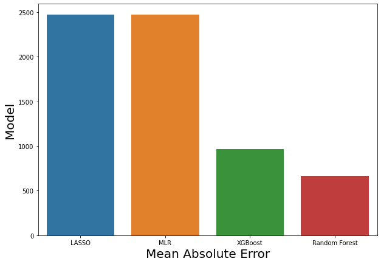
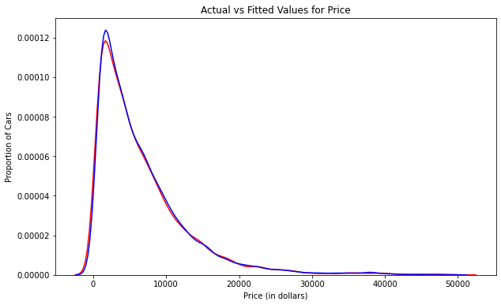
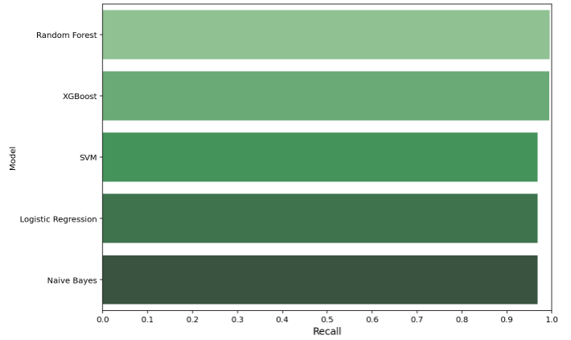
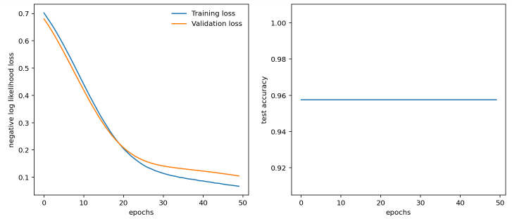
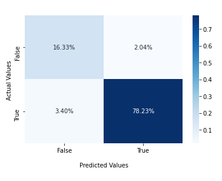
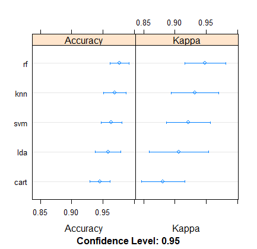

# Abdulwahid_Portfolio
This portfolio contains various data science projects.\
**Note: To access the project please click on the project title**
# [Project 1: Prediction of Used Car Prices using Exploratory Data Analysis and Regression Models](https://github.com/Abdlwhd/Prediction_of_Used_Car_Prices)
* Built a prediction tool using a regression model
* Demonstrated Exploratory and Descriptive Analysis to highlight significant features
* Applied data transformation and preprocessing techniques to clean and transform the data
* Used RF, XGBoost, Multiple Linear Regression and LASSO to find the best model
* Evaluation metrices include MAE,MSE,R-square and Distribution Plot
* Best model achieved an Mean Absolute Error of approximately 667

# [Project 2: Fake Job Postings Detection Using Natural Language Processing and Data Mining Techniques](https://github.com/Abdlwhd/Fake_Job_Postings_Detection)
* Built a fraud job postings detection tool using NLP and machine learning models
* Performed Descriptive and Exploratory Analysis to gain useful insights about the data
* Applied preprocessing techniques to clean and transform the data
* Implemented a NLP approach to convert text data to vectors
* Optimized RF, XGBoost, Logistic Regression, Mutlinomial Naive bayes and SVM classifier to find the best model
* Applied a Multi-preceptron using Pytorch for better evaluation
* Evaluation metrices include confusion matrix, ROC analysis, Model compariosn and  Deep learning perfomance analysis
* Best model achieved an accuracy of approximately 99.5%

 

# [Project 3: Diagnosis of Alzheimer's Disease by Integrating Machine and Manifold Learning Models](https://github.com/Abdlwhd/Diagnosis_of_Alzheimer_Disease)
* Built a framework for diagnosis Alzheimer's disease using MRI features
* Performed Exploratory Analysis to gain useful insights about the data
* Applied preprocessing techniques to clean and transform the data
* Utilized a manifold learning approach (PCA) for dimensionality reduction
* Used a regression model to verify feature importance
* Optimized SVM, KNN, Logistic Regression, Naive bayes and Decision Tree classifier to find the best model
* Evaluated the machine learning models using ROC analysis and confusion matrix
* Best model achieved an accuracy of approximately 95%

# [Project 4: Breast Cancer Detection using Various Machine Learning Models](https://github.com/Abdlwhd/Breast_Cancer_Detection)
* Built a detection model for diagnosis of Breast cancer in R
* Designed visualizations like (density plot, box plot, bar plot etc.) for Exploratory Data Analysis
* Applied preprocessing techniques to clean the data
* Utilized cross validation to boost model's efficiency
* Built SVM, KNN, Random Forest, CART and LDA to find the best model
* Evaluated the machine learning models using dot plot and model plots

