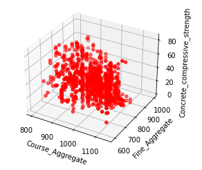

# Abdulwahid_Portfolio
This portfolio contains various data science projects.
# [Project 1: Diagnosis of Alzheimer's Disease by Integrating Machine and Manifold Learning Models](https://github.com/Abdlwhd/Diagnosis_of_Alzheimer_Disease)
* Built a framework for diagnosis Azlheimer's disease using MRI features
* Performed Exploratory Analysis to gain useful insights about the data
* Applied preprocessing techniques to clean and transfrom the data
* Utilized a manifold learning approach (PCA) for dimensionality reduction
* Used a regression model to verify feature importance
* Optimized SVM, KNN, Logistic Regression, Naive bayes and Decision Tree classifier to find the best model
* Evaluated the machine learning models using ROC analysis and confusion matrix
* Best model achieved an accuracy of approx 95%

# [Project 2: Breast Cancer Detection using Various Machine Learning Models](https://github.com/Abdlwhd/Breast_Cancer_Detection)
* Built a detection model for diagnosis of Breast cancer in R
* Designed visualizations like (density plot, box plot, bar plot etc.) for Exploratory Data Analysis
* Applied preprocessing techniques to clean the data
* Utilized cross validation to boost model's efficiency
* Built SVM, KNN, Random Forest, CART and LDA to find the best model
* Evaluated the machine learning models using dotplot and model plots

# [Project 3: Prediction of Concrete Compressive Strength using Regression Model](https://github.com/Abdlwhd/Breast_Cancer_Detection)
* Built a regression model for prediction of Concrete Compressive Strength
* Enforced various preprocessing techniques to clean the data
* Conducted an exploratory analysis to find importance features
* Applied data transformation to increase model perfomance
* Built Multiple Linear Regression Model for prediction

